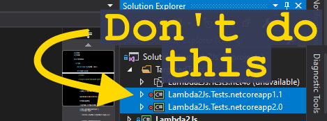
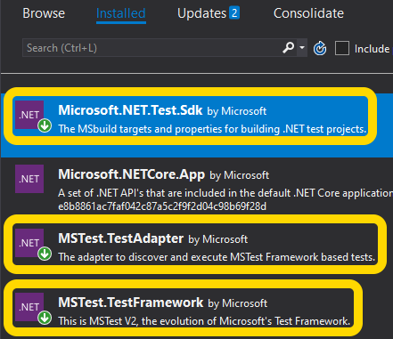

# Lambda2Js

This is an ExpressionTree (lambda) to Javascript converter.

It is portable, so that you can use it in most environments.

Its purpose is to convert a C# expression tree (from Linq name space) to a syntactically correct javascript code.

It can be extended to customize the mapping of expressions:
- support custom static methods, instead of emitting code that would otherwise depend on external Javascript
- support custom types, converting method calls and properties accordingly

It is well tested, and won't break. **More than 140 tests passing**.

This project uses Semantic versioning.

Installing [NuGet package](https://www.nuget.org/packages/Lambda2Js):

    PM> Install-Package Lambda2Js

Samples
-------

Converting lambda with boolean and numeric operations:

    Expression<Func<MyClass, object>> expr = x => x.PhonesByName["Miguel"].DDD == 32 || x.Phones.Length != 1;
    var js = expr.CompileToJavascript();
    // js = PhonesByName["Miguel"].DDD===32||Phones.length!==1

Converting lambda with LINQ expression, containing an inner lambda:

    Expression<Func<MyClass, object>> expr = x => x.Phones.FirstOrDefault(p => p.DDD > 10);
    var js = expr.CompileToJavascript();
    // js = System.Linq.Enumerable.FirstOrDefault(Phones,function(p){return p.DDD>10;})

Converting lambda with Linq `Select` method:

	Expression<Func<string[], IEnumerable<char>>> expr = array => array.Select(x => x[0]);
    var js = expr.CompileToJavascript(
        new JavascriptCompilationOptions(
            JsCompilationFlags.BodyOnly | JsCompilationFlags.ScopeParameter,
            new[] { new LinqMethods(), }));
    // js = array.map(function(x){return x[0];})

Clone using `ToArray` and targeting ES6:

    Expression<Func<string[], IEnumerable<string>>> expr = array => array.ToArray();
    var js = expr.Body.CompileToJavascript(
        ScriptVersion.Es60,
        new JavascriptCompilationOptions(new LinqMethods()));
    // js = [...array]

Developing custom plugins
--------

You can develop and use some built-in plugins. See the [readme.md in the Plugins folder](https://github.com/gearz-lab/lambda2js/tree/master/Lambda2Js/Plugins).

# Building and testing

***ATENTION!*** Please, run the **ProjectsGenerator**
before doing any of these:

- build the signed assembly
- running tests for specific frameworks

    

Due to current Visual Studio limitations, I had to create
a project generator to create some of the `csproj` files:

- **Lambda2Js.Signed.csproj** is generated using the
`Lambda2Js.csproj` as it's template. It will copy the
package version to the FileVersion and to the
AssemblyVersion fields to keep them consistent.
Also, it adds the `".Signed"` string where appropriate
in file names and in project name, and finally it
includes a reference to the snk file.

- **Lambda2Js.Tests.$(TargetFramework).csproj** are
generated from `Lambda2Js.Tests.csproj`. That is needed
because this project is a multitargeted test project,
and Visual Studio cannot see the tests inside after
compiling it... so what I did was: create copy projects
that have only one target framework for each of the
possible targets.

## Testing

To test support on the .Net 4.0, you need to run the
`Test.Net-v4.0.csproj` because this framework version
does not support the native test attributes to do
automatic testing.

To test other framework versions, please, take a 
look at the `TargetedTests` solution folder. In that 
folder you will find all the tests. Unload all of them, 
but keep the framework version you want to test, 
then build it. Visual Studio will see the newly built 
tests and will list them. If the other frameworks test 
projects are not unloaded, Visual Studio may or may 
not list them.

**Errors while building test projects**

Make sure to NOT LOAD MORE THAN ONE test project inside the TargetedTests solution folder.

- Load a single test project

    

- Update Test Framework Packages

    
